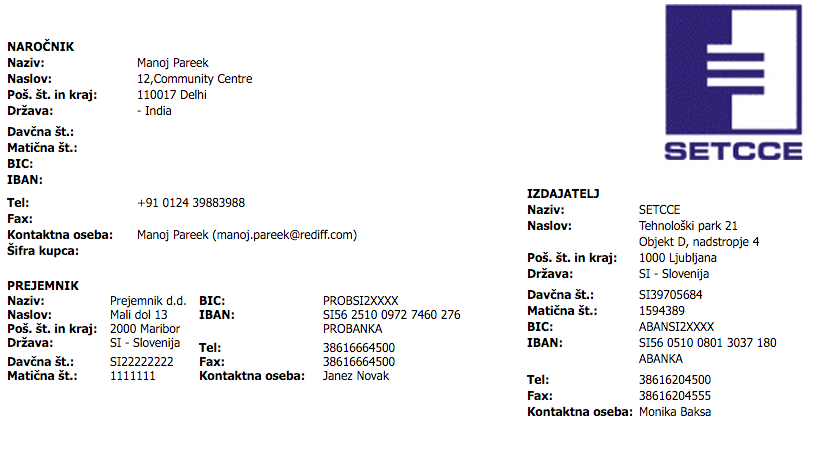

# Spletna prodajalna e-Pesmi+

3\. domača naloga pri predmetu [Osnove informacijskih sistemov](https://ucilnica1516.fri.uni-lj.si/course/view.php?id=54) (navodila)

## Opis naloge in navodila

Na [GitHub](https://github.com) je na voljo javni repozitorij [https://github.com/szitnik/prodajalna](https://github.com/szitnik/prodajalna), ki vsebuje Node.js spletno prodajalno, ki je podobna prodajalni iz vaj V6. V okviru domače naloge ustvarite lastno kopijo repozitorija ter dopolnite obstoječo implementacijo spletne prodajalne kot zahtevajo navodila. Domača naloga zahteva poznavanje GIT ukazov, HTML označb, CSS stilov, jezika JavaScript, Node.js tehnologije z izbranimi knjižnicami in XML zapis podatkov. Pri delu **natančno sledite navodilom**!

Spletno povezavo na [GitHub](https://github.com) repozitorij podate kot `https://github.com/{študent}/prodajalna`, kjer _{študent}_ predstavlja vaše [GitHub](https://github.com) uporabniško ime. Spletno povezavo na uveljavitev v [GitHub](https://github.com) repozitoriju podate kot `https://github.com/{študent}/prodajalna/compare/{commit}`, kjer je _{commit}_ identifikator ustrezne uveljavitve. Le-tega pridobite na spletni strani [GitHub](https://github.com) repozitorija v zavihku _Commits_ pod _Code_, kjer je vsaki uveljavitvi pripisan SHA identifikator (uporabite možnost _Copy the full SHA_).

## Vzpostavitev okolja in repozitorija

Na [GitHub](https://github.com) z uporabo funkcije _Fork_ ustvarite lastno kopijo repozitorija [https://github.com/szitnik/prodajalna](https://github.com/szitnik/prodajalna) v okviru katere boste opravljali domačo nalogo. Kopija repozitorija naj ostane javna in naj ohrani ime _"prodajalna"_. Z uporabo podanih GIT ukazov v ukazni lupini razvojnega okolja [Cloud9](https://c9.io) vzpostavite lokalni repozitorij ter ustvarite veje razvoja _registracija_, _izbira-stranke_, _prikaz-racuna_ in _prikaz-racuna-trenutni_ v okviru katerih boste reševali posamezne naloge. Na koncu vse spremembe uveljavite še v oddaljenem [GitHub](https://github.com) repozitoriju.

###### Kako naj rešujem?

Na veji **_master_** ustvarite prazno uveljavitev s komentarjem "Začetek dela na domači nalogi". Nato ustvarite sledeče veje in v vsaki ustvarite prazno uveljavitev s komentarjem:

* **_registracija_** - "Začetek dela na I. nalogi"
* **_izbira-stranke_** - "Začetek dela na II. nalogi"
* **_prikaz-racuna_** - "Začetek dela na III. nalogi"
* **_prikaz-racuna-trenutni_** - "Začetek dela na IV. nalogi"

Vse spremembe nato uveljavite še v vašem oddaljenem repozitoriju.

###### Kaj oddam na eUcilnici?
Spletno povezavo na ustvarjen [GitHub](https://github.com) repozitorij.

```
Repozitorij: https://github.com/{študent}/prodajalna
```

## I. Registracija nove stranke

Na spletni strani _/prijava_ zaključite z implementacijo obrazca _Registracija_ tako, da se v bazo doda nova stranka glede na vnešene podatke v obrazcu. Za nove stranke naj bo odgovorna Jane Peacock (vrednost _SupportRepId_ nastavite na vrednost 3). Po uspešnem shranjevanju naj se spletna stran ponovno naloži, da je nova stranka vidna v seznamu vseh strank in v polju z imenom _sporocilo_ naj se izpiše obvestilo "Stranka je bila uspešno registrirana.". V primeru neuspešnega shranjevanja pa naj se pri ponovno naloženi strani v polju z imenom _sporocilo_ izpiše obvestilo "Prišlo je do napake pri registraciji nove stranke. Prosim preverite vnešene podatke in poskusite znova."

###### Kako naj rešujem?

Zahtevane spremembe implementirajte v predhodno ustvarjeni veji **_registracija_**. Med delom lahko smiselno uveljavljajte spremembe v lokalnem in oddaljenem [GitHub](https://github.com) repozitoriju, dočim pa ob koncu spremembe uveljavite s sporočilom _"Zaključek dela na I. nalogi"_. Prav tako naj bodo vse spremembe v veji vidne tudi v vašem oddaljenem repozitoriju.

###### Kaj oddam na eUcilnici?
Spletno povezavo na zadnjo uveljavitev v [GitHub](https://github.com) repozitoriju v veji **_registracija_** s sporočilom _"Zaključek dela na I. nalogi"_, ki vključuje vse zahtevane spremembe.

```
I. naloga: https://github.com/{študent}/prodajalna/compare/{commit}
```

## II. Prijava z izbrano stranko

Na spletni strani _/prijava_ ste opazili, da lahko izberete poljubno stranko, za katero lahko nato napolnite košarico. Pri trenutni implementaciji se lahko osnovna spletna stran (_https://vasa-poddomena.c9users.io/_) odpre, čeprav predhodno ne izberete nobene stranke. Dopolnite implementacijo tako, da uporabnika v primeru, ko odpre osnovno spletno stran brez, da bi predhodno izbral stranko na strani _/prijava_, avtomatsko preusmeri na stran _/prijava_. Na osnovni spletni strani morate implementirati tudi delovanje gumba **_Odjava_**, ki naj razveljavi trenutno izbiro stranke in uporabnika preusmeri na spletno stran _/prijava_ (Namig: pomagajte si s sejno spremenljivko).

###### Kako naj rešujem?

Zahtevane spremembe implementirajte v predhodno ustvarjeni veji **_izbira-stranke_**. Med delom lahko smiselno uveljavljajte spremembe v lokalnem in oddaljenem [GitHub](https://github.com) repozitoriju, dočim pa ob koncu spremembe uveljavite s sporočilom _"Zaključek dela na II. nalogi"_. Prav tako naj bodo vse spremembe v veji vidne tudi v vašem oddaljenem repozitoriju.

###### Kaj oddam na eUcilnici?
Spletno povezavo na zadnjo uveljavitev v [GitHub](https://github.com) repozitoriju v veji **_izbira-stranke_** s sporočilom _"Zaključek dela na II. nalogi"_, ki vključuje vse zahtevane spremembe.

```
II. naloga: https://github.com/{študent}/prodajalna/compare/{commit}
```

## III. Prikaz računa iz podatkovne baze

Na spletni strani _/prijava_ lahko opazite seznam računov, ki se nahajajo v podatkovni bazi. V primeru, da izberete na enega izmed njih, se vam odpre prazna stran. Dopolnite implementacijo aplikacije tako, da se vam namesto prazne strani v novem zavihku odpre HTML prikaz izbranega računa. Za vsak račun tudi veste, kdo ga je naročil (angl. Customer), zato v račun tudi ustrezno vnesite podatke o stranki.

Podatke o stranki vnesite v razdelek računa, ki definira naročnika. Polja, ki jih morate upoštevati in primer je prikazan v razdelku A. Dodatek 1.

###### Kako naj rešujem?

Zahtevane spremembe implementirajte v predhodno ustvarjeni veji **_prikaz-racuna_**. Med delom lahko smiselno uveljavljajte spremembe v lokalnem in oddaljenem [GitHub](https://github.com) repozitoriju, dočim pa ob koncu spremembe uveljavite s sporočilom _"Zaključek dela na III. nalogi"_. Prav tako naj bodo vse spremembe v veji vidne tudi v vašem oddaljenem repozitoriju.

###### Kaj oddam na eUcilnici?
Spletno povezavo na zadnjo uveljavitev v [GitHub](https://github.com) repozitoriju v veji **_prikaz-racuna_** s sporočilom _"Zaključek dela na III. nalogi"_, ki vključuje vse zahtevane spremembe.

```
III. naloga: https://github.com/{študent}/prodajalna/compare/{commit}
```

## IV. Prikaz računa za trenutno stranko in njeno košarico

Sedaj ste mogoče že opazili neskladno delovanje aplikacije, saj če izberete eno izmed strank na strani _/prijava_, napolnite njeno košarico in pripravite račun, se vedno pripravi račun za istega naročnika. Spremenite implementacijo spletne strani tako, da se vam ob kliku na gumb **_Pripravi račun (HTML)_** ali **_Pripravi račun (XML)_** v novem zavihku pripravi ustrezen račun za vašo izbrano stranko (t.j. naročnika).

Podatke o stranki vnesite v razdelek računa, ki definira naročnika. Polja, ki jih morate upoštevati in primer je prikazan v razdelku A. Dodatek 1.

###### Kako naj rešujem?

Zahtevane spremembe implementirajte v predhodno ustvarjeni veji **_prikaz-racuna-trenutni_**. Med delom lahko smiselno uveljavljajte spremembe v lokalnem in oddaljenem [GitHub](https://github.com) repozitoriju, dočim pa ob koncu spremembe uveljavite s sporočilom _"Zaključek dela na IV. nalogi"_. Prav tako naj bodo vse spremembe v veji vidne tudi v vašem oddaljenem repozitoriju.

###### Kaj oddam na eUcilnici?
Spletno povezavo na zadnjo uveljavitev v [GitHub](https://github.com) repozitoriju v veji **_prikaz-racuna-trenutni_** s sporočilom _"Zaključek dela na IV. nalogi"_, ki vključuje vse zahtevane spremembe.

```
IV. naloga: https://github.com/{študent}/prodajalna/compare/{commit}
```

## V. Združevanje sprememb v repozitoriju

Z uporabo GIT ukazov v ukazni lupini razvojnega okolja [Cloud9](https://c9.io) veje razvoja _registracija_, _izbira-stranke_, _prikaz-racuna_ in _prikaz-racuna-trenutni_ združite v vejo _master_. Pri tem pazite, da samih vej ne izbrišete. Na koncu v repozitorij dodajte še Markdown datoteko _avtorstvo.md_, ki naj vsebuje podano vsebino.

```markdown
Študent z vpisno številko _{vpisna}_ potrjujem, da sem __edini avtor__ oddane domače naloge.
```

###### Kako naj rešujem?

Zahtevane spremembe implementirajte v veji **_master_**. Med delom lahko smiselno uveljavljajte spremembe v lokalnem in oddaljenem [GitHub](https://github.com) repozitoriju, dočim pa ob koncu spremembe uveljavite s sporočilom _"Zaključek dela na domači nalogi"_. Prav tako naj bodo vse spremembe v veji vidne tudi v vašem oddaljenem repozitoriju.

###### Kaj oddam na eUcilnici?
Spletno povezavo na zadnjo uveljavitev v [GitHub](https://github.com) repozitoriju v veji **_master_** s sporočilom _"Zaključek dela na domači nalogi"_, ki vključuje vse zahtevane spremembe.

```
V. naloga: https://github.com/{študent}/prodajalna/compare/{commit}
```

## A. Dodatek 1
V tem dodatku opisujemo, kako je potrebno nastavljati podatke o naročniku, ko pripravljamo račun za stranko prodajalne e-Pesmi+.

Kopiranje vrednosti:

| Podatki o naročniku na računu           | Potrebna polja iz podatkovne baze |
|-----------------------------------------|-----------------------------------|
| NazivPartnerja1                         | FirstName LastName                |
| NazivPartnerja2                         | Company                           |
| Ulica1                                  | Address                           |
| Kraj                                    | City                              |
| NazivDrzave                             | Country                           |
| PostnaStevilka                          | PostalCode                        |
| Komunikacije->StevilkaKomunikacije (TE) | Phone                             |
| Komunikacije->StevilkaKomunikacije (FX) | Fax                               |
| Ime Osebe                               | FirstName LastName (Email)        |

V podatkovni bazi nimamo definiranih vseh podatkov, ki bi jih potrebovali za pripravo računa, zato bodo nekateri razdelki računa za naročnika neizpolnjeni:

* KodaDrzave
* ReferencniPodatkiPodjetja
* FinancniPodatkiPodjetja

Primer izgleda obstoječega računa _"Manoj Pareek (412) - 2011-12-22"_:
